# competitor-research

`competitor-research` is a research skill for Codex, Claude Code, and Antigravity.

In simple terms: you tell it a product feature or workflow you want to understand, and it researches how competitors handle it. It looks at public evidence like websites, pricing pages, help centers, changelogs, app stores, videos, reviews, and forums. Then it gives you a detailed markdown report with screenshots, links, feature comparisons, pricing notes, customer sentiment, unknowns, and recommendations.

Example:

```text
I want to become an expert on payment links.
How do competitors handle creation, management, sharing, pricing,
and what do customers love or hate?
```

The skill is designed so a product manager, designer, founder, or researcher can understand a market without manually opening dozens of tabs.

No Figma file, competitor account, password, or API key is required for the default public research mode.

## What It Does

The skill helps answer questions like:

- Who are the important competitors for this feature?
- What do they say publicly about the feature?
- What capabilities do they support?
- How do they price it?
- What does the user flow look like?
- What do customers praise, dislike, or complain about?
- Which claims are proven by evidence, which are inferred, and which are still unknown?
- What opportunities does this create for our product?

It works public-first. That means it does not start by asking for logins or passwords. Competitor accounts are optional and are only used if you explicitly ask for authenticated research.

## How The Workflow Thinks

This is the high-level workflow. It is vertical on purpose so you can follow the decision path from top to bottom.

```mermaid
flowchart TD
    A["User asks a research question"] --> B{"Is the research question clear?"}

    B -- "No" --> B1["Ask the user to clarify the feature, workflow, competitors, or scope"]
    B1 --> B

    B -- "Yes" --> C["Create a fresh run folder under runs/<research-name>/<timestamp>/"]
    C --> D["Write AGENTS.md guard files so older runs are not reused accidentally"]
    D --> E{"Did the user provide specific competitors?"}

    E -- "Yes" --> E1["Use the provided competitor list"]
    E1 --> F

    E -- "No" --> E2["Search the web for relevant competitors"]
    E2 --> E3["Rank 5 to 10 competitors by relevance and confidence"]
    E3 --> F

    F["Gather market context"] --> F1{"Is a locale or region mentioned?"}
    F1 -- "Yes" --> F2["Research regional platforms, pricing, regulations, and local availability"]
    F1 -- "No" --> F3["Use global market context"]
    F2 --> G
    F3 --> G

    G["Build a public source map for each competitor"] --> G1["Find homepages, feature pages, pricing pages, docs, help centers, changelogs, app stores, videos, reviews, forums, and comparison pages"]
    G1 --> H["Save source-map.json before evidence capture starts"]

    H --> I["Identify subfeatures and capabilities across competitors"]
    I --> J["Build a feature matrix"]
    J --> J1{"Is support directly proven by public evidence?"}

    J1 -- "Yes" --> J2["Mark as supported or partially supported and cite the source"]
    J1 -- "No" --> J3["Mark as unknown instead of guessing"]
    J2 --> K
    J3 --> K

    K["Collect evidence for each competitor"] --> K1["Capture screenshots and record source URLs"]
    K1 --> K2["Analyze public task flows, pricing, positioning, docs, and customer sentiment"]

    K2 --> L{"Did the user explicitly request authenticated research?"}
    L -- "No" --> M["Continue with public evidence only"]

    L -- "Yes" --> L1{"Are credentials available for this competitor?"}
    L1 -- "No" --> L2["Keep competitor in the report with public evidence and explicit unknowns"]
    L1 -- "Yes" --> L3["Use credentials only for that competitor"]
    L3 --> L4{"Does login hit 2FA, CAPTCHA, SMS, email verification, or suspicious-login checks?"}
    L4 -- "Yes" --> L5["Pause, hand the browser to the user, wait for confirmation, then resume"]
    L4 -- "No" --> L6["Capture authenticated evidence"]
    L5 --> M
    L6 --> M
    L2 --> M

    M["Synthesize the research"] --> N["Separate observed facts, inferences, unknowns, and confidence levels"]
    N --> O["Write output/research.md"]
    O --> P["Save screenshots and other evidence in output/assets/"]
    P --> Q{"Did the user provide a Figma destination URL?"}
    Q -- "Yes" --> Q1["Optionally export visual findings to Figma"]
    Q -- "No" --> R["Finish with markdown report and linked assets"]
    Q1 --> R
```



## Evidence Rules

The report separates evidence into clear labels:

| Label | Meaning |
| --- | --- |
| Observed | Directly seen in a source, screenshot, page, video, review, or document |
| Inferred | A conclusion drawn from observed evidence |
| Unknown | Something the research could not prove |
| Confidence | High, medium, or low confidence based on available evidence |

The skill should not present a guess as a fact.

## Expected Output

Each research run creates a new folder. A typical result looks like this:

```text
runs/
  AGENTS.md
  payment-links/
    AGENTS.md
    2026-04-24T10-30-00Z/
      AGENTS.md
      source-map.json
      output/
        research.md
        sources.md
        assets/
          stripe-homepage.png
          stripe-pricing.png
          stripe-help-payment-links.png
          square-pricing.png
          paypal-youtube-flow-step-03.png
```

The most important file is:

```text
output/research.md
```

If the run generates a separate source index, it is saved as:

```text
output/sources.md
```

That report normally includes:

1. Executive summary
2. Market landscape
3. Research goal and scope
4. Competitors covered
5. Methodology
6. Feature matrix
7. Per-competitor deep dives
8. Pricing comparison
9. Customer sentiment analysis
10. Cross-competitor patterns and findings
11. Opportunities and recommendations
12. Unknowns and gaps
13. Source index

Screenshots and other captured assets live in:

```text
output/assets/
```

The `source-map.json` file records which public sources were found or attempted before evidence collection.

## Install Or Update

You only need to do this once per app. The same command also updates an existing install.

### Before You Start

You need:

- Codex, Claude Code, or Antigravity installed
- Terminal on your computer
- Git available in Terminal

If Terminal says `git` is missing, run this first:

```bash
xcode-select --install
```

Then try the install command again.

### How To Open Terminal On macOS

1. Press `Command + Space`.
2. Type `Terminal`.
3. Press `Return`.
4. Paste the command for your app.
5. Press `Return`.
6. Wait until it says the skill was installed.
7. Close and reopen your AI coding app.

You do not need to understand every line in the command. It downloads this repository into a temporary folder, installs the skill, and removes the temporary folder afterward.

### Install For Codex

Paste this into Terminal:

```bash
rm -rf /tmp/ui-competitor-research-install && \
git clone https://github.com/pedrocarlop/UI-competitor-research.git /tmp/ui-competitor-research-install && \
bash /tmp/ui-competitor-research-install/scripts/install-skill-codex.sh && \
rm -rf /tmp/ui-competitor-research-install
```

Then close and reopen Codex.

### Install For Claude Code

Paste this into Terminal:

```bash
rm -rf /tmp/ui-competitor-research-install && \
git clone https://github.com/pedrocarlop/UI-competitor-research.git /tmp/ui-competitor-research-install && \
bash /tmp/ui-competitor-research-install/scripts/install-skill-claude.sh && \
rm -rf /tmp/ui-competitor-research-install
```

Then close and reopen Claude Code.

### Install For Antigravity

Paste this into Terminal:

```bash
rm -rf /tmp/ui-competitor-research-install && \
git clone https://github.com/pedrocarlop/UI-competitor-research.git /tmp/ui-competitor-research-install && \
bash /tmp/ui-competitor-research-install/scripts/install-skill-antigravity.sh && \
rm -rf /tmp/ui-competitor-research-install
```

Then close and reopen Antigravity.

## How To Use It

After installing, ask your app to run the skill.

Codex or Antigravity:

```text
Please run competitor-research.

research_question:
How do competitors handle payment link creation, management, and sharing?

company_name:
Northstar Commerce
```

Claude Code:

```text
/competitor-research

research_question:
How do competitors handle payment link creation, management, and sharing?

company_name:
Northstar Commerce
```

You can also name competitors directly:

```text
Please run competitor-research.

research_question:
Compare onboarding flows for developer-facing API products.

competitors:
["Stripe", "Twilio", "Algolia"]
```

## Good Research Questions

Good prompts are specific about the feature or workflow:

```text
Compare how Stripe, Square, and PayPal present payment link creation to merchants.
Gather evidence from feature pages, help centers, pricing pages, and public demos.
```

```text
Research how top project management tools handle recurring task automation.
Focus on Asana, Monday.com, ClickUp, and Notion.
```

```text
Compare how Intercom, Zendesk, and Freshdesk document chatbot setup.
Focus on help center articles and public video walkthroughs.
```

## Public Research Vs Login Research

Public research is the default and recommended mode.

It uses:

- Company websites
- Feature pages
- Pricing pages
- Help centers and support docs
- FAQs
- Changelogs and release notes
- Blog posts when directly relevant
- App store listings and screenshots
- YouTube demos and walkthroughs
- Review sites
- Forums and social discussions
- Product directories and comparison pages

Login research is optional. It is only used when:

- You explicitly request it
- Public evidence is not enough
- You have access credentials for a specific competitor
- The login flow is realistic to complete

The skill should never bypass CAPTCHA, 2FA, SMS verification, email verification, or suspicious-login checks. If one appears, it pauses and lets you complete the challenge in the browser.

## Credentials

The skill does not ask for credentials at the start.

If authenticated research is needed, provide credentials through environment variables or a separate credential registry file. Keep real credential files out of version control.

Example credential registry:

```json
{
  "competitors": [
    {
      "competitor_name": "Stripe",
      "login_url": "https://dashboard.stripe.com/login",
      "email_env": "STRIPE_RESEARCH_EMAIL",
      "password_env": "STRIPE_RESEARCH_PASSWORD",
      "start_url": "https://dashboard.stripe.com/payment-links",
      "navigation_hints": ["payment links"]
    }
  ]
}
```

Then reference the file with `credential_registry_path` or `credentials_path` in your request.

## Optional Figma Export

Figma export is optional. The skill works without Figma.

If you provide a `figma_destination_url`, the workflow can also create a visual export of key findings. The markdown report remains the main output.

## Run Isolation

Each new research run should use only the current request and current public sources.

Older runs under `runs/` are not used as context unless you explicitly ask to resume, audit, compare, or import a specific previous run. This prevents old pricing, old screenshots, or old competitor assumptions from contaminating new research.

## Development Checks

For maintainers:

```bash
npm run typecheck
npm run validate:schemas
npm test
```

These checks cover input normalization, explicit competitor discovery, source-map generation, public capture without credentials, schema drift guards, and report contract sections.
